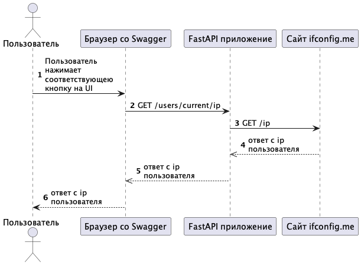
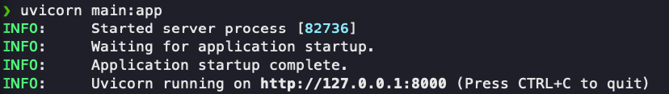
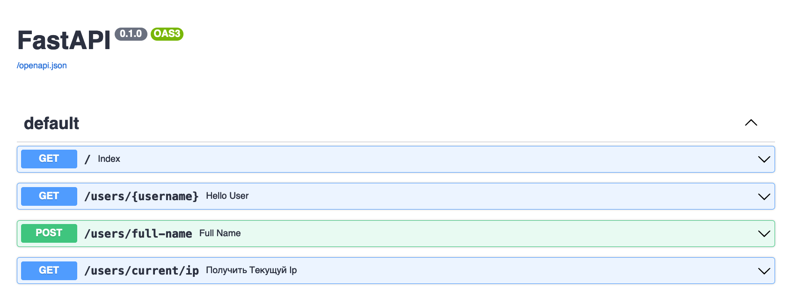

= Лабораторная работа FastAPI
:reproducible:
:listing-caption: Listing
:source-highlighter: rouge
:toc:
:toc-title: Содержание
:toclevels: 2
:title-page:
:pdf-page-size: Letter

== Сравнение фреймворков

=== Django

==== Общая информация 

Django (Джанго) - свободный фреймворк для веб-приложений на языке Python, использующий шаблон проектирования MVC.
Проект поддерживается организацией Django Software Foundation.

Сайт на Django строится из одного или нескольких приложений, которые рекомендуется делать отчуждаемыми и подключаемыми.
Это одно из существенных архитектурных отличий этого фреймворка от других. Один из основных принципов фреймворка - DRY (Don't reapeat yourself)

MVC - это архитектура "Модель-Представление-Контроллер". Контроллер классической модели MVC примерно соответствует уровню,
который в Django называется *Представление* (View), а презентационная логика Представления реализуется в Django уровне *Шаблонов* (Template).
Из-за этого уровневую архитектуру Django часто называют "Модель-Шаблон-Представление" (MTV).

==== Основные возможности 

* Свой ORM из коробки
* Встроенный интерфейс администратора
* Диспетчер URL на основе регулярных выражений
* Расширяемая система шаблонов с тегами и наследованием
* Система кэширования
* Подключаемая архитектура приложений, которые можно устанавливать на любые Django-сайты
* Авторизация и аутентификация из коробки, подключение внешних модулей: LDAP, OpenID и прочее.
* Наследование шаблонов
* Система фильтров ("middleware") для построения дополнительных обработчиков запросов, как например включенные 
в дистрибутив фильтры для кэша, нормализации URL и поддержки анонимных сессий

==== Применение 

Когда не стоит использовать Django

* Вы имеете дело с колоссальным приложением, и оно не умещается в одной базе кода.
Лучше разбить ваше приложение на микросервисы и использовать более легкие фреймворки.
* Необходимо написать простейшее приложение, в котором не требуется работать с базой данных,
выполнять операции с файлами или делать что-либо сложное.
* Вы хотите написать все с нуля.  

=== Flask

==== Общая информация 

Flask - фреймворк для создания веб-приложений на языке программирования Python, использующий набор инструментов Werkzeug,
а также шаблонизатор Jinja2. Относится к категории микрофреймворков - минималистичный каркас веб-приложения. Сознательно
предоставляющих лишь самые базовые возможности для работы. 

==== Основные возможности 

* Сервер разработки и отладчик
* Интегрированная поддержка модульного тестирования (расширение для PyTests)
* Отправка запросов RESTful
* Используется шаблонизатор Jinja2
* Поддержка безопасных файлов cookie
* 100% соответствие WSG 1.0
* На основе Uvicode
* Обширная документация
* Доступны расширения для улучшения функциональности

==== Применение 

=== FastAPI

FastAPI - это фреймворк, для создания лаконичных и довольно быстрых HTTP API-сервисов
со свтроенной валидацей, сериализацией и асинхроностью из коробки.
Базируется на двух других фреймворках:

* Syarlette - отвечает за работу с web
* Pydantic - отвечает за валидацию

==== Основные возможности 

* Аннотации типов
* Универсальный подход к обработке всего "Приходящего"
* Schema-oriented: openapi.json и отсюда Swagger, Redoc, Pydantic
* Инверсия зависимостей 
* Совмещение асинхронного подсета языка с синхронным 
* Скорость разработки и выполнения
* Лучше всего продходит для HTTP based API 
** REST
** JSON over HTTP
** JSON RPC
* Подходит для Websocket приложений и GrafQL приложений

==== Больше про аннотации типов 

* Можно задавать обязательные параметры
* Автоматически валидируются данные
* Автоматически конвертируются данные 
* Автоматически выдаются ошибки

==== Depends

Инверсия зависимостей с помощью класса Depends  

* Подходит для выявления любых общих кусков логики
* Можно организовать подключение внешних ресурсов, например БД
* Depends можно использовать и в функциях, и в декораторах, и в самом "приложении"
* Львиную долю логики можно писать через инверсию

==== Чего нет 

* Нет ORM
* Нет возможности генерировать данные по Pydantic для тестовых данных

==== Применение 

Подойдет если для вас важно 

* Асинхронность
* Типизированность
* Встроенная документация
* Применение Websocket

== Практика 

=== Настройка окружения

В данном примере будем использовать conda, но антологичные команды можно выполнить и через pip и vnev

Посмотрим список наших окружений 

[source,bash]
----
conda env list
----

Создадим новое окружение 

[source,bash]
----
conda create --name fastAPI  python=3.10
----

Посмотрим список наших окружений и убедимся что новое окружение есть в списке

[source,bash]
----
conda env list
----

Активируем наше окружение 

[source,bash]
----
conda activate fastAPI_MEPHI_lab
----

Теперь создаем папку с нашим проектом со следующей структурой 

[source]
----
.
├── app
│      ├── __init__.py
│      ├── forms.py
│      ├── handlers.py
│      ├── query.py 
│      └── main.py
└── requirements.txt
----
В файле `requirements.txt` мы пропишем все наши зависимости. Для упрощения не будем указывать конкретные версии пакетов

[source,python]
----
fastapi
uvicorn
SQLAlchemy
pytest
requests
----

Теперь необходимо установить все зависимости, которые нам нужны 

[source,bash]
----
conda install -c conda-forge --file requirements.txt
----

=== Написание приложения 

Далее описан код в каждом из файлов 

*main.py*

[source,python]
----
from fastapi import FastAPI

from handlers import router

def get_application() -> FastAPI:
    application = FastAPI()
    application.include_router(router)
    return application

app = get_application()
----

link:app/main.py[Смотреть файл с кодом]

Это базовая реализация приложения Fast API, которое включает в себя маршрутизатор. Функция `get_application()` создает и возвращает экземпляр Fast API, включает в него маршрутизатор с помощью метода `include_router()` и возвращает экземпляр. Экземпляр сохраняется в переменной app.

Ожидается, что модуль обработчиков будет содержать объект `router`, который передается экземпляру Fast API. Вы можете определить свои маршруты API и соответствующие им обработчики в модуле `handlers`, используя декораторы API, такие как `@router.get()`, `@router.post()` и т.д.

*handlers.py*

[source,python]
----
from fastapi import APIRouter, Body

from forms import UserNameParts

from query import getIp

router = APIRouter()

@router.get('/')
async def index():
    return {'status': 'Ok'}

@router.get("/users/{username}", name='Hello user')
async def read_user(username: str):
    return {"message": f'Hello {username}'}

@router.post('/users/full-name', name='Full name')
async def login(user_from: UserNameParts = Body(..., embed=True)):
    return {"fullName": f'{user_from.lastName.strip()} {user_from.firstName.strip()} {user_from.middleName.strip()}'}

@router.get('/users/current/ip', name='Получить текущуй ip')
async def current_ip():
    ip = getIp()

    return ip
----

link:app/handlers.py[Смотреть файл с кодом]

В коде выше определено несколько эндпоинтов, включая корневую конечную точку по адресу /, которая просто возвращает объект JSON, указывающий на то, что сервер запущен.

Второй эндпоинт `/users/{username}` принимает параметр пути username и возвращает персонализированное сообщение.

Третий кэндпоинт - это *POST-запрос* к `/users/full-name`, который принимает тело JSON с тремя полями: `FirstName`, `LastName` и `MiddleName` и возвращает полное имя в формате "Фамилия имя отчество".

Четверый  - это запрос GET к /users/current/ip, который возвращает текущий IP-адрес пользователя, используя запрос в стороний сервис. Это разберем позже.

*forms.py*

[source,python]
----
from pydantic import BaseModel

class UserNameParts(BaseModel):
    lastName: str
    firstName: str
    middleName: str
----

link:app/forms.py[Смотреть файл с кодом]

Класс `UserNameParts` - это базовая модель Pedantic, которая определяет структуру данных, которые будут получены от клиента в теле запроса `/users/full-name`. В нем есть три поля: `LastName`, `FirstName` и `MiddleName`, все из которых имеют тип `str`.

Этот класс позволяет Fast API автоматически генерировать схему JSON для тела запроса и выполнять проверку данных, гарантируя, что входящие данные соответствуют ожидаемой структуре и типам. Используя Pedantic модели, мы можем сократить объем шаблонного кода, необходимого для анализа входящих данных и выполнения валидационных проверок.

*query.py*
[source,python]
----
import requests

def getIp():

    url = "https://ifconfig.me/ip"
    payload = {}
    headers = {}

    response = requests.request("GET", url, headers=headers, data=payload)

    return response.text
----

link:app/query.py[Смотреть файл с кодом]

Это функция Python, которая использует библиотеку requests для выполнения запроса GET к URL-адресу "https://ifconfig.me/ip " и возвращает тело ответа в виде строки, которая должна быть текущим IP-адресом пользователя. Вот краткое описание того, что происходит в коде:

* Библиотека запросов импортируется в верхней части файла.
* Функция `getIp()` определена без параметров.
* URL-адрес для получения IP-адреса присваивается переменной url.
* Создаются пустой словарь полезной нагрузки и словарь заголовков.
* Метод `requests.request()` вызывается с использованием HTTP-метода "GET", URL-адреса, заголовков и полезной нагрузки в качестве аргументов.
* Объект `response` возвращается, и осуществляется доступ к его текстовому атрибуту для извлечения тела ответа в виде строки.
* Наконец, строка IP-адреса возвращается из функции `getIp()`.

На сиквенс диаграмме ниже представлена работа последнего метода приложения

=== Запуск приложения 

Для запуска прилжения нужно открыть термал в папке с файлом main.py и выполнить следующею команду 

[source,bash]
----
uvicorn main:app
----

Результат выполнения на скриншоте ниже ниже 

Видим что наше приложение запущено на локальном ip с портом 8000

Для того чтоб открыть Swagger введите следующий адрес в вашем браузере http://127.0.0.1:8000/docs

Вы должны увидеть слудеющее 

== Задания лабораторной работы

=== Задание 1

Используя материалы лекции реализуйте новый метод `GET /users/current/full-time` который будет выполнять запрос опредения ip как в лекции и дополнительным шагом узнает дату по ip из сервиса  https://www.timeapi.io/swagger/index.html.
Ознакомтись с документацией и выберете нужный метод.

=== Задание 2

Реализуйте метод с помощью которого пользователь будет отправлять свою дату рождения, а в ответ получать названия своего знака задиака и гороскоп на сегодня. Для получения гороскопов использовать сервис https://www.ohmanda.com/api/horoscope/

