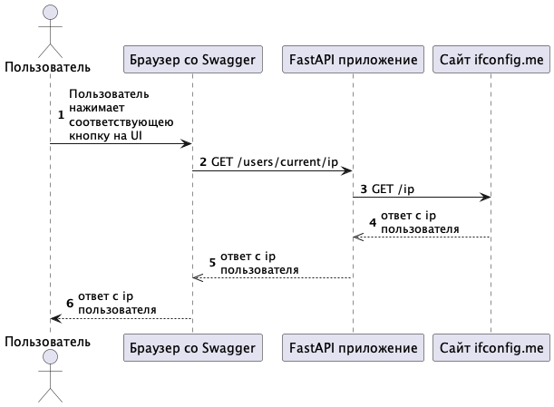
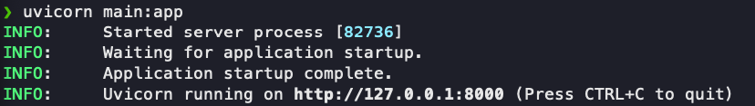
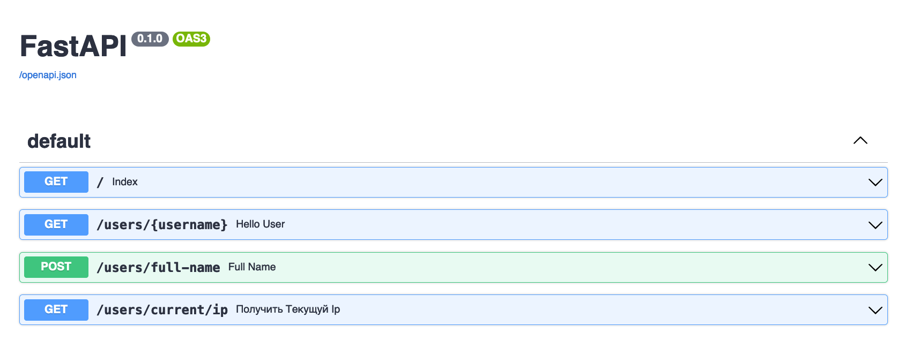

= Лабораторная работа FastAPI
:reproducible:
:listing-caption: Listing
:source-highlighter: rouge
:toc:
:toc-title: Содержание
:toclevels: 2
:title-page:
:pdf-page-size: Letter

== Сравнение фреймворков

=== Django

==== Общая информация

Django (Джанго) - свободный фреймворк для веб-приложений на языке Python, использующий шаблон проектирования MVC.
Проект поддерживается организацией Django Software Foundation.

Сайт на Django строится из одного или нескольких приложений, которые рекомендуется делать отчуждаемыми и подключаемыми.
Это одно из существенных архитектурных отличий этого фреймворка от других. Один из основных принципов фреймворка - DRY (Don't repeat yourself)

MVC - это архитектура "Модель-Представление-Контроллер". Контроллер классической модели MVC примерно соответствует уровню,
который в Django называется *Представление* (View), а презентационная логика Представления реализуется в Django уровне *Шаблонов* (Template).
Из-за этого уровневую архитектуру Django часто называют "Модель-Шаблон-Представление" (MTV).

==== Основные возможности

* Свой ORM из коробки
* Встроенный интерфейс администратора
* Диспетчер URL на основе регулярных выражений
* Расширяемая система шаблонов с тегами и наследованием
* Система кэширования
* Подключаемая архитектура приложений, которые можно устанавливать на любые Django-сайты
* Авторизация и аутентификация из коробки, подключение внешних модулей: LDAP, OpenID и прочее.
* Наследование шаблонов
* Система фильтров ("middleware") для построения дополнительных обработчиков запросов, как например включённые
в дистрибутив фильтры для кэша, нормализации URL и поддержки анонимных сессий

==== Применение

Когда не стоит использовать Django

* Вы имеете дело с колоссальным приложением, и оно не умещается в одной базе кода.
Лучше разбить ваше приложение на микросервисы и использовать более легкие фреймворки.
* Необходимо написать простейшее приложение, в котором не требуется работать с базой данных,
выполнять операции с файлами или делать что-либо сложное.
* Вы хотите написать все с нуля.

=== Flask

==== Общая информация

Flask - фреймворк для создания веб-приложений на языке программирования Python, использующий набор инструментов Werkzeug,
а также шаблонизатор Jinja2. Относится к категории микрофреймворков - минималистичный каркас веб-приложения. Сознательно
предоставляющий лишь самые базовые возможности для работы.

==== Основные возможности

* Сервер разработки и отладчик
* Интегрированная поддержка модульного тестирования (расширение для PyTests)
* Отправка запросов RESTful
* Используется шаблонизатор Jinja2
* Поддержка безопасных файлов cookie
* 100% соответствие WSGI 1.0
* На основе Unicode
* Обширная документация
* Доступны расширения для улучшения функциональности

==== Применение

=== FastAPI

FastAPI - это фреймворк для создания лаконичных и довольно быстрых HTTP API-сервисов
со встроенной валидацией, сериализацией и асинхронностью из коробки.
Базируется на двух других фреймворках:

* Starlette - отвечает за работу с web
* Pydantic - отвечает за валидацию

==== Основные возможности

* Аннотации типов
* Универсальный подход к обработке всего "Приходящего"
* Schema-oriented: openapi.json и отсюда Swagger, Redoc, Pydantic
* Инверсия зависимостей
* Совмещение асинхронного подмножества языка с синхронным
* Скорость разработки и выполнения
* Лучше всего подходит для HTTP based API
** REST
** JSON over HTTP
** JSON RPC
* Подходит для Websocket приложений и GraphQL приложений

==== Больше про аннотации типов

* Можно задавать обязательные параметры
* Автоматически валидируются данные
* Автоматически конвертируются данные
* Автоматически выдаются ошибки

==== Depends

Инверсия зависимостей с помощью класса Depends

* Подходит для выявления любых общих кусков логики
* Можно организовать подключение внешних ресурсов, например БД
* Depends можно использовать и в функциях, и в декораторах, и в самом "приложении"
* Львиную долю логики можно писать через инверсию

==== Чего нет

* Нет ORM
* Нет возможности генерировать данные по Pydantic для тестовых данных

==== Применение

Подойдет если для вас важно

* Асинхронность
* Типизированность
* Встроенная документация
* Применение Websocket

== Практика

=== Настройка окружения

В данном примере будем использовать conda, но аналогичные команды можно выполнить и через pip и venv
Посмотрим список наших окружений

[source,bash]
----
conda env list
----

Создадим новое окружение

[source,bash]
----
conda create --name fastAPI  python=3.10
----

Посмотрим список наших окружений и убедимся что новое окружение есть в списке

[source,bash]
----
conda env list
----

Активируем наше окружение

[source,bash]
----
conda activate fastAPI_MEPHI_lab
----

Теперь создаем папку с нашим проектом со следующей структурой

[source,text]
----
.
├── app
│    ├── __init__.py
│    ├── forms.py
│    ├── handlers.py
│    ├── query.py
│    └── main.py
└── requirements.txt
----

В файле `requirements.txt` мы пропишем все наши зависимости. Для упрощения не будем указывать конкретные версии пакетов

[source,text]
----
fastapi
uvicorn
SQLAlchemy
pytest
requests
----

Теперь необходимо установить все зависимости, которые нам нужны

[source,bash]
----
conda install -c conda-forge --file requirements.txt
----

=== Написание приложения

Далее описан код в каждом из файлов

*main.py*

[source,python]
----
from fastapi import FastAPI

from handlers import router

def get_application() -> FastAPI:
    application = FastAPI()
    application.include_router(router)
    return application

app = get_application()
----

link:app/main.py[Смотреть файл с кодом]

Это базовая реализация приложения FastAPI, которое включает в себя маршрутизатор. Функция `get_application()` создает и возвращает экземпляр FastAPI, включает в него маршрутизатор с помощью метода `include_router()` и возвращает экземпляр. Экземпляр сохраняется в переменной app.

Ожидается, что модуль обработчиков будет содержать объект `router`, который передается экземпляру FastAPI. Вы можете определить свои маршруты API и соответствующие им обработчики в модуле `handlers`, используя декораторы API, такие как `@router.get()`, `@router.post()` и т.д.

*handlers.py*

[source,python]
----
from fastapi import APIRouter, Body

from forms import UserNameParts

from query import getIp, getTime, getHoroscope, getZodiacSign

router = APIRouter()

@router.get('/')
async def index():
    return {'status': 'Ok'}

@router.get("/users/{username}", name='Hello user')
async def read_user(username: str):
    return {"message": f'Hello {username}'}

@router.post('/users/full-name', name='Full name')
async def full_name(user_from: UserNameParts = Body(..., embed=True)):
    return {"fullName": f'{user_from.lastName.strip()} {user_from.firstName.strip()} {user_from.middleName.strip()}'}

@router.get('/users/current/ip', name='Получить текущий ip')
async def current_ip():
    ip = getIp()
    return ip

@router.get('/users/current/full-time', name='Получить текущее время')
async def current_full_time():
    ip = getIp()
    full_time = getTime(ip)
    return full_time

@router.post('/horoscope', name='Получить гороскоп')
async def horoscope(birth_data: BirthDate):
    day = birth_data.birthDate.day
    month = birth_data.birthDate.month
    sign = getZodiacSign(day, month)
    horoscope_data = getHoroscope(sign)
    return {
        "sign": sign,
        "horoscope": horoscope_data.get("horoscope", "Нет данных")
    }
----

link:app/handlers.py[Смотреть файл с кодом]

В коде выше определено несколько эндпоинтов, включая корневую конечную точку по адресу /, которая просто возвращает объект JSON, указывающий на то, что сервер запущен.

Второй эндпоинт `/users/{username}` принимает параметр пути username и возвращает персонализированное сообщение.

Третий эндпоинт - это *POST-запрос* к `/users/full-name`, который принимает тело JSON с тремя полями: `FirstName`, `LastName` и `MiddleName` и возвращает полное имя в формате "Фамилия имя отчество".

Четвёртый - это запрос GET к /users/current/ip, который возвращает текущий IP-адрес пользователя, используя запрос в сторонний сервис.

Пятый - это запрос GET к /users/current/full-time, который получает текущий IP-адрес и затем по IP-адресу получает текущее время из внешнего API.

Шестой - это POST-запрос к /horoscope, который принимает дату рождения в теле запроса, определяет знак зодиака по дате и возвращает гороскоп на сегодняшний день.

*forms.py*

[source,python]
----
from pydantic import BaseModel
from datetime import date

class UserNameParts(BaseModel):
    lastName: str
    firstName: str
    middleName: str

class BirthDate(BaseModel):
    birthDate: date
----

link:app/forms.py[Смотреть файл с кодом]

Класс `UserNameParts` - это базовая модель Pydantic, которая определяет структуру данных, которые будут получены от клиента в теле запроса `/users/full-name`. В нём есть три поля: `lastName`, `firstName` и `middleName`, все из которых имеют тип `str`.

Класс `BirthDate` - это модель Pydantic для валидации даты рождения, которая содержит одно поле `birthDate` типа `date`.

Эти классы позволяют FastAPI автоматически генерировать схему JSON для тела запроса и выполнять проверку данных, гарантируя, что входящие данные соответствуют ожидаемой структуре и типам. Используя Pydantic модели, мы можем сократить объем шаблонного кода, необходимого для анализа входящих данных и выполнения валидационных проверок.

*query.py*

[source,python]
----
import requests
from typing import Dict

def getIp() -> str:
    url = "https://ifconfig.me/ip"
    payload = {}
    headers = {}

    response = requests.request("GET", url, headers=headers, data=payload)
    return response.text.strip()

def getTime(ip: str) -> Dict[str, str]:
    url = f"https://www.timeapi.io/api/Time/current/ip?ipAddress={ip}"
    payload = {}
    headers = {
        'accept': 'application/json'
    }

    response = requests.request("GET", url, headers=headers, data=payload)
    return response.json()

def getHoroscope(sign: str) -> Dict[str, str]:
    url = f"https://www.ohmanda.com/api/horoscope/today?sign={sign}"
    payload = {}
    headers = {}

    response = requests.request("GET", url, headers=headers, data=payload)
    return response.json()

def getZodiacSign(day: int, month: int) -> str:
    if (month == 3 and day >= 21) or (month == 4 and day <= 19):
        return "aries"  # Овен
    elif (month == 4 and day >= 20) or (month == 5 and day <= 20):
        return "taurus"  # Телец
    elif (month == 5 and day >= 21) or (month == 6 and day <= 20):
        return "gemini"  # Близнецы
    elif (month == 6 and day >= 21) or (month == 7 and day <= 22):
        return "cancer"  # Рак
    elif (month == 7 and day >= 23) or (month == 8 and day <= 22):
        return "leo"  # Лев
    elif (month == 8 and day >= 23) or (month == 9 and day <= 22):
        return "virgo"  # Дева
    elif (month == 9 and day >= 23) or (month == 10 and day <= 22):
        return "libra"  # Весы
    elif (month == 10 and day >= 23) or (month == 11 and day <= 21):
        return "scorpio"  # Скорпион
    elif (month == 11 and day >= 22) or (month == 12 and day <= 21):
        return "sagittarius"  # Стрелец
    elif (month == 12 and day >= 22) or (month == 1 and day <= 19):
        return "capricorn"  # Козерог
    elif (month == 1 and day >= 20) or (month == 2 and day <= 18):
        return "aquarius"  # Водолей
    elif (month == 2 and day >= 19) or (month == 3 and day <= 20):
        return "pisces"  # Рыбы
    else:
        raise ValueError("Некорректная дата")
----

link:app/query.py[Смотреть файл с кодом]

Функция `getIp()` выполняет запрос GET к URL-адресу "https://ifconfig.me/ip" и возвращает тело ответа в виде строки, которая должна быть текущим IP-адресом пользователя.

Функция `getTime(ip)` выполняет запрос GET к API https://www.timeapi.io/api/Time/current/ip с передачей IP-адреса в параметрах запроса и возвращает информацию о времени в формате JSON.

Функция `getHoroscope(sign)` выполняет запрос GET к API https://www.ohmanda.com/api/horoscope/today с передачей знака зодиака в параметрах запроса и возвращает гороскоп в формате JSON.

Функция `getZodiacSign(day, month)` определяет знак зодиака по дате рождения. Она принимает день и месяц рождения и возвращает название знака зодиака на английском.

На sequence диаграмме ниже представлена работа последнего метода приложения

=== Запуск приложения

Для запуска приложения нужно открыть терминал в папке с файлом main.py и выполнить следующую команду

[source,bash]
----
uvicorn main:app --reload
----

Результат выполнения на скриншоте ниже ниже

Видим что наше приложение запущено на локальном ip с портом 8000

Для того чтобы открыть Swagger введите следующий адрес в вашем браузере http://127.0.0.1:8000/docs

Вы должны увидеть следующее

== Задания лабораторной работы

=== Задание 1

Используя материалы лекции реализуйте новый метод `GET /users/current/full-time` который будет выполнять запрос определения ip как в лекции и дополнительным шагом узнает дату по ip из сервиса https://www.timeapi.io/swagger/index.html.
Ознакомьтесь с документацией и выберите нужный метод.

*Примечание:* Этот эндпоинт уже реализован в коде. Вы можете изучить его в файле `app/handlers.py`.

=== Задание 2

Реализуйте метод с помощью которого пользователь будет отправлять свою дату рождения, а в ответ получать названия своего знака зодиака и гороскоп на сегодня. Для получения гороскопов использовать сервис https://www.ohmanda.com/api/horoscope/

*Примечание:* Этот эндпоинт уже реализован в коде. Вы можете изучить его в файле `app/handlers.py`.

**Дополнительное задание (по желанию):**

Изучите реализованные эндпоинты и попробуйте:

* Добавить валидацию для даты рождения (например, не должна быть в будущем)
* Добавить обработку ошибок при неудачных запросах к внешним API
* Добавить эндпоинт для получения гороскопа на завтрашний день
* Добавить документацию для каждого эндпоинта через docstrings
